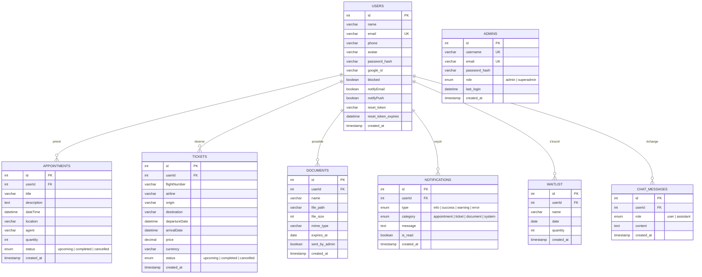

# Modèle de données — Nestor Vocal

## MCD / MLD (notation Mermaid ERD)

> Reconstitué à partir du schéma réellement observé en base (colonnes
> confirmées via `DESCRIBE`, requêtes `INSERT`/`SELECT` du code). Si tes
> vrais types diffèrent légèrement (ex. `VARCHAR(255)` vs `TEXT`), ajuste —
> la structure et les relations, elles, sont fiables.

## Règles de gestion

- Un utilisateur (`USERS`) peut avoir **0 à N** rendez-vous, billets, documents,
  notifications, inscriptions en liste d'attente et messages de conversation.
- `ADMINS` est une table **totalement séparée** de `USERS` — pas de relation
  directe, deux systèmes d'authentification distincts (JWT différents :
  `JWT_SECRET` vs `ADMIN_JWT_SECRET`).
- `WAITLIST.date` + `WAITLIST.userId` doivent être **uniques ensemble**
  (un utilisateur ne peut s'inscrire qu'une fois par jour) — voir
  `joinWaitlist()` dans `appointments.ts`, qui vérifie ça applicativement.
  Il serait plus robuste de l'imposer aussi en base (voir
  `constraints.sql`).
- `APPOINTMENTS.dateTime` doit être **unique parmi les rendez-vous au statut
  `upcoming`** (un seul rendez-vous par créneau) — actuellement vérifié
  uniquement côté application (`assertSlotAvailable()`), pas en base.
- `TICKETS.status`, `APPOINTMENTS.status` partagent les mêmes valeurs
  possibles (`upcoming`/`completed`/`cancelled`) mais sont deux colonnes
  indépendantes, pas de table de référence commune.

## Normalisation

Le schéma est en **3NF** : chaque table ne dépend que de sa clé primaire
(pas de dépendance transitive), pas de données répétées entre tables — les
seules redondances contrôlées sont les `userName` calculés par `JOIN` dans
les requêtes admin (`admin.ts`), jamais stockés physiquement.
